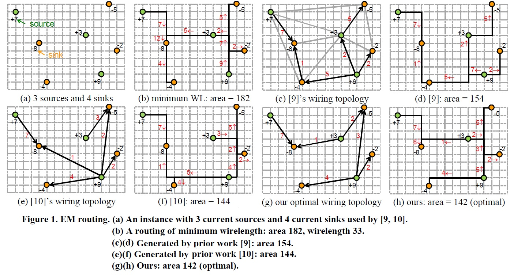

# Optimal Wiring Topology for Electromigration Avoidance

This is a implementation of [this paper](http://dx.doi.org/10.1145/1735023.1735064) (Iris H.-R. Jiang, Hua-Yu Chang, and Chih-Long Chang. 2010).
The paper proposes a method to determine the wiring configuration with minimum wire area. It first applies Greedy Algorithm to find a admissible (but not optimal) wiring configuration and the using [Network Flow Algorithm](https://en.wikipedia.org/wiki/Flow_network) and elminate the negative cycles in the residual graph to achieve optimal configuration.
<p style="text-align:center"></p> 

## Input & Output

### Input
1. The integer N in the first line is the number of source points and sink points.
2. Each of following N lines records the x- & y-coordinates of the points and the flow current of the source or sink.
```
# Sample input
7
1 10 +7	#this is a source point at (1, 10) with flow=7
4 6 -8	#this is a sink point at (4, 6) with flow=4
5 1 -4
10 7 +3
12 2 +9
14 5 -2
13 11 -5
```

### Output
1. The first line describes the wire area of the resulting wiring configuration.
2. Following lines records the x- & y-coordinates of source & sink points and the amount of flow current.
```
# Sample output
142		        # optimal wire area
1 10 4 6 7		# a current amount=7 flow from (1, 10) to (4,6)
10 7 4 6 1
10 7 13 11 2
12 2 5 1 4
12 2 13 11 3
12 2 14 5 2

```
## Compile & Execution
### Compile
A executable binary file named "build" will be generated.
``` 
make
```

### Execute
```
./build <input_file> <output_file>
```
## Demo
Test 1: [input](https://github.com/mattwang44/algorithm-practice/blob/master/Optimal%20Wiring%20Topology%20for%20Electromigration%20Avoidance/input/INP1.txt) & [output](https://github.com/mattwang44/algorithm-practice/blob/master/Optimal%20Wiring%20Topology%20for%20Electromigration%20Avoidance/output/INP1.out)  

Test 2: [input](https://github.com/mattwang44/algorithm-practice/blob/master/Optimal%20Wiring%20Topology%20for%20Electromigration%20Avoidance/input/INP4.txt) & [output](https://github.com/mattwang44/algorithm-practice/blob/master/Optimal%20Wiring%20Topology%20for%20Electromigration%20Avoidance/output/INP4.out)  

Test 3: [input](https://github.com/mattwang44/algorithm-practice/blob/master/Optimal%20Wiring%20Topology%20for%20Electromigration%20Avoidance/input/RT05.txt) & [output](https://github.com/mattwang44/algorithm-practice/blob/master/Optimal%20Wiring%20Topology%20for%20Electromigration%20Avoidance/output/RT05.out)  

## Reference
1. Iris H.-R. Jiang, Hua-Yu Chang, and Chih-Long Chang. 2010. Optimal wiring topology for electromigration avoidance considering multiple layers and obstacles. In Proceedings of the 19th international symposium on Physical design (ISPD '10). ACM, New York, NY, USA, 177-184. [link](http://dx.doi.org/10.1145/1735023.1735064)
